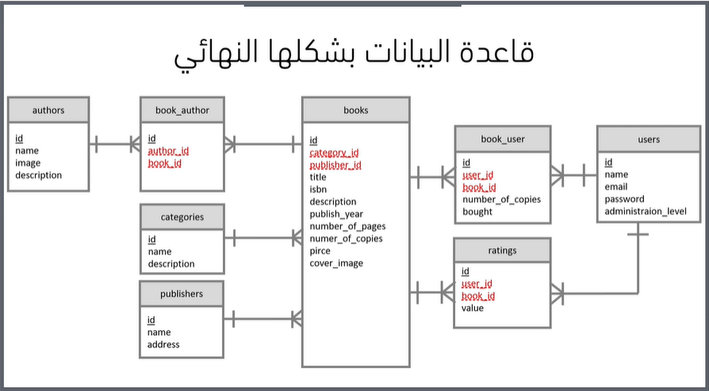
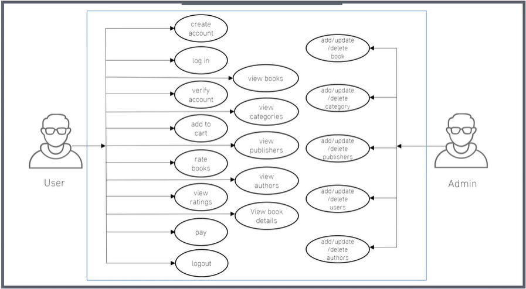

# Book Store

## Short Description
Book Store is a full-stack Laravel e-commerce application for browsing books, filtering by category/author/publisher, managing a cart, checking out, and tracking purchased products. It also includes an admin dashboard for managing catalog data and users.

## Technologies
- PHP 8.2
- Laravel 12
- Laravel Jetstream (authentication)
- Laravel Sanctum
- Livewire 3
- Laravel Cashier (payments/billing flow)
- MySQL or SQLite (via Laravel migrations)
- Vite + Tailwind CSS + PostCSS
- Pest / PHPUnit (testing)

## Features
- Public gallery/home page with search
- Book details page with rating system
- Browsing and filtering by categories, authors, and publishers
- Shopping cart management (add item, remove one, remove all)
- Checkout and purchase flow
- My Products page for authenticated users
- Admin area with CRUD for books, categories, authors, publishers, and users
- Authorization gates/middleware for protected admin routes

## Database Diagram
This diagram shows the core database entities and relationships used by the bookstore application.



## The Process
1. Visitor browses books from the gallery and uses search/filters.
2. Visitor opens a book details page and can submit a rating.
3. User adds books to cart and updates quantities.
4. User proceeds to checkout and completes purchase.
5. Purchased items appear in My Products.
6. Admin users manage inventory and metadata from the admin dashboard.

This diagram illustrates the end-to-end user flow from browsing and rating books to checkout and post-purchase management.



## Running The Project
1. Clone the repository:
```bash
git clone https://github.com/mahmoud20212/book-store.git
cd book-store
```

2. Install backend dependencies:
```bash
composer install
```

3. Create environment file and app key:
```bash
copy .env.example .env
php artisan key:generate
```

4. Configure your database in `.env`, then run migrations:
```bash
php artisan migrate
```

5. Install frontend dependencies and build assets:
```bash
npm install
npm run build
```

6. Start the development environment:
```bash
composer run dev
```

7. Open the app:
```text
http://127.0.0.1:8000
```

### Optional Commands
Run tests:
```bash
php artisan test
```

One-command local setup:
```bash
composer run setup
```
